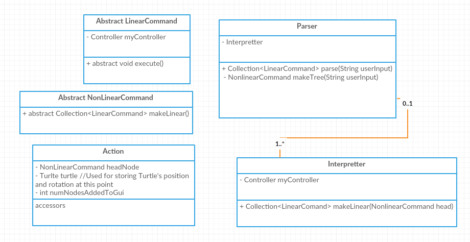
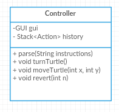

#BackEnd:
Jonathan Im (jji93)
Ryan St.Pierre (ras70)

Below is the internal backend API:

The external API will be driven by the controller 

* For the back-end, the API consists for basic functionality solely of the parse command. Our controller class takes in a string from the gui and will delegate parsing to a parsing and interpreting class, which will return a linear list of the actual commands that the turtle will need to do.
* We will use hierarchies of Non-linear and linear command objects to construct trees in order to help us go from input text into the actual commands for the turtle. 
  *  As we parse the text, we will convert key commands into an instance of a non-linear command object, of the type that corresponds to the type of command.
  * These non-linear command objects will hold children, which are themselves non-linear command objects, of the types as determined during the actual parsing of the string input.
  * Each non-linear command object has the ability to output a collection of linear command objects, each subclass implementing an abstract method to do so.
  * Thus using recursion, we construct the tree of non-linear command from the text, and then we traverse the tree and flatten it into a list of actually actionable things that the turtle must do by calling the getLinearCommand method on each
  * Polymorphism will make it easy to implement the different types of language behavoirs that we need:
    * The repeat slogo command for example will to implement the getLinearCommands consist of a for loop that loops through the children that it has for the number times specified in the input string and calls getLinearCommand on each child, aggregates that into a collection and returns that collection.
* The controller class will then take this  list of linearCommands  that must be done and will call the execute on each one
  * Thus we are using polymorphism again for the actual behavior of the turtle
  * In the event that we would like to extend our program to support undos and redos, we will cache at this point while we iterate through the linearCommands to be executed things like the current state of the turtle on the screen, the number of nodes that were added to the display to execute a command and a reference to the head of the non-linear command tree as generated by the parser so that we can if needed later recreate the history of the commmands that were run in order to get to the current state as seen on the screen
* 

#Use Cases: 

**1:** The user types 'fd 50' in the command window, sees the turtle move in the display window leaving a trail, and has the command added to the environment's history.

In GamePane:

	Controller.parse(Input) //where input is the String receive from the user
	updateHistory() {
		convertStackToListofText(controller.getHistory);
	}

In Controller:

	parse(String input) {
		Collection<LinearCommand> commands = Parse.parse(input);
		int counter;
		for (LinearCommand command: commands) {
			counter = counter + command.execute();
		}
		Action action = new Action(commands, GUI.getTurleAttributes(), counter);
		history.add(action);
	}

In Parser: 

	parse(String input){ 
	
		return Interpretter.flatten(makeTree(input));
	
	}
	
**2:** The user types '50 fd' in the command window and sees an error message that the command was not formatted correctly.

In Controller:

	try{ 
		Parser.parse(input);
	} catch(CommandException e) {
		GamePane.handleError(e.message());
	}
	
In GamePane

	handleError(String input) {
		showAlert(input);
	}
	
In Backend: throw exception when necessary

**3:** The user types 'pu fd 50 pd fd 50' in the command window and sees the turtle move twice (once without a trail and once with a trail)

The same flow will hold with that in case 1.  Whether or not the trail is drawn is determined by the LinearCommands the Controller is given. Specified linear commands upon execution can changed the stored state in the Controller of whether or not the pen is up or done. Every time the front end goes to draw they will access this stored value in the Controller to determine whether or not the pen is up or down.

**4:** The user changes the color of the environment's background.

	Color color = startColorChooser();
	setBackground(color);
	

