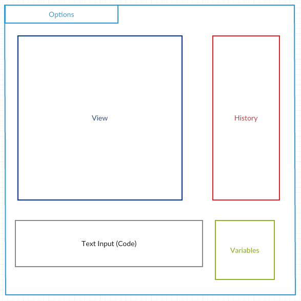

## Introduction

The intent of this program is to create an interactive IDE that allows users to execute code in the Slogo language. The goals of the project are as follows:

1. Create an easy to use interface that can easily be extended to include new features.  
2. Create a system that is capable of parsing String representing Slogo language into a Java structure in which Eclipse (or an other Java IDE) can interpret and execute. 
3. Off a parsing model that offers easy extendibility for commands/code following the Slogo read-eval-print style.
4. Create a communication system, through the controller, that connects the front and back end in a way that is efficient but still allows the front and back end to maintain their distinct purposes. 

Open: 
* Modules for adding to the display
* Commands (Linear and nonlinear) in the backend

Closed: 
* The main display 
* Parser that generates the Tree command structure 
* Interpreter that executes the tree of commands the parser generates 
* Controller that maintains the communication between the front and back end

## Design Overview

We have divided the project into 3 main components: the model, view, and controller.  

The **Model** is responsible for holding an abstract representation of the state of the board.  This includes where the turtle and other lines are located with respect to the central point and the turtle's rotation. To properly distinguish between the model and view this abstract information that the model holds should be able to be represented in a multitude of ways. The Model is responsible for interpreting a tree of commands given from the parser and updating its state.

The **View** is responsible for representing the information of the model.  The view should have no information of how the model constructed its information, but render the model of the screen.  In addition, the view has the capacity to visualize the changes in the model as the controller delegates relevant information about the model to the view. Lastly, the view should offer features to the user relating to the state of the model, such as history.

The **Controller** is the link of communication between the Model and View.  The View gives information to the Controller from the user to Parse.  The Controller then parses this information and gives it in the form in which the model can interpret, which in this case is a tree of commands.  The Model updates itself based on this input and sends back a series of "simple" commands to the Controller, which then delegates to the proper recipient to commit the simple command. 

In this form, the functionality is provided to change the visual representation of the model without changing the model itself and the model can be changed without changing the front end.

View: see front end package. 
Model: see backend package.
Controller: Controller, Parser

####APIs
#####Back End APIs:

**SlogoModelActions (External)**

The SlogoModelActions API is used for external communication between the Model.java class and the Controller.  Functionally, these will provide methods for the controller to tell the Model to manipulate its state based on input values.

**NonLinearCommand (Internal)**

The NonLinearCommand API is an internal API which allows for extending the power of the Model.

#####Front End APIs:

**VisualizationActions API (External)**
VisualizationActions API is called by the Controller to deliver visualizations of turtle movements when it detects changes in the Model. It includes methods. It has essentially the same methods as the SlogoModelActions API.

**Modules (Internal)**
The different modules corresponding to the different GUI component allows for extending the power of the View.

####Classes

**Front End**

The GUI consists of four major components. Text Field, upon receiving text commands from users, notifies the Controller, which in turn initiates the parsing and updating process. The Controller gets notified when the Model gets updated and passes relevant information to the View through the VisualizationActions API to update the visualization. More specifically, Text Field would have a method  `addController(Controller controller)`  which adds the Controller as an event listener to the "Run" button. The Model would have a similar method which adds the Controller as an event listener to some of the values or actions.

Options allows users to customize the modules on the GUI. We do this by creating a state class for each of the module which encapsulates the parameters that users can modify such as background color, image, etc. The parameters are changed dynamically as users interact with the dropdown menu of the Options in GUI, and these changes are mapped to changes in the visualization accordingly. This design prevents hard coding and makes the front end extensible to more complicated UI requirements. 

History displays the past user commands and relevant information about the turtle. Whenever the Model gets updated, the Controller accesses the Model's history information through `getHistory()` method of the Model, and calls the `updateHistory()` method on History to update the history view.

**Backend** 

The backend receives the String input from the Front end through the Controller.  The Controller delegates the parsing of the String code to the Parser class.  The Parse class uses the `parseString(String input)` method to convert the code into a tree of NonLinearCommands.  Each NonLinearCommand knows how many attributes and parameters it needs.  Thus, each NonLinearCommand will keep collection data until it is satisfied. This will continue until the tree recursively builds itself.  There is a method called `getNextCommand()` in the Parser class for getting the next readable instance in the form of a string.  This "readable instance" is the next word/symbol separated by whitespace.  The `getNonLinearCommandForString()` is a factory method that takes that String and converts it into a NonLinearCommand that can be used in the tree.

Once the information is parsed it is sent to the Interpreter to interpret.  The Interpreter loops through the tree, left to right, and turns the nested, NonLinearCommands into a linear progression of simplistic commands that can be converted directly to java code.  The Interpreter will execute the commands as it traverses the Tree. The command will execute to update the necessary component of the model, information stored in the Model class.  The Turtle class is currently written to store that attributes of the turtle in the Model.

Each new command that needs to be written will extend NonLinearCommand.  This requires each command to have an associated value, determine whether or not it is satisfied, and have the ability to execute.  In addition, in implementation the commands will store a map of their variables.  Thus, each command will have access to its variables and the variables of its parents. This will help automatically account for scope. 

The Action class is created every time the parse, interpret, delegate cycle is complete.  This Action class stores an instance of the last piece of code that was execute and that which was associated with it.  Saving this information allows for future implementation of dynamic history features like redo and undo.  This will be implemented in some form of a stack of Actions.  This will allow the user to pop off the top of the stack to revert to previous changes.

Once the code has been parsed, interpreted, and saved the Controller will tell the front end to render itself based on the state of the model.  

*Visualization*

## User Interface

The design will look as follows:

Each block given above is a Module.  There functionalities are: 

*Options* 

The options bar is a drop-down menu that gives the user the chance to select a module.  Clicked the desired module will start a stage that allows the user to change the state of that module.
 
*View*

The View will display the turtle after the code is executed.  It will rely on the information from the model to render itself.

*Code*

Allows the user to type in code, by accepting all key input.  Will then allow the user to execute the code with a button labeled execute.

*History*

Will give the history of the prior commands.  Will allow the user to click on these commands into the text view (code) where they can be executed again.

*Variables* 

Will display the current variables in the code.  Will allow the user space to delete a given variable or bring it into the text view with clicks.

## API Details

For the backend API refer to the *SlogoModelActions.java* and *NonLinearCommand.java* interfaces and accompanying comments in the interfaces_slogo_team04.

The SlogoModelActions interface is everything necessary for the Controller to external control the model.  These methods specifically correlate to everything in the model that can directly be changed by code.  The result of any given Slogo at this point can directly be represented by a progression of these method calls.  For example, the *fd* and *rt* Slogo commands correspond to the *forward* and *setHeading* method sin the SlogoModelAction interface.

The NonLinearCommand interface lays out what is necessary to add a feature that extends the back end code detection.  The given command must execute.  This means it must *do* something.  The second requirement is a return.  Each Slogo command returns a type double.  Thus, we are allowing for extendibility in commands if the user creates a command that returns a double when `getValue()` is called.  The `isDoneConstructing()` requirement is crucial for the functionality of building the tree in Parser.  In the Tree building in Parser, each node will continue to add children until it is "satisfied."  This means each command has a certain number of *attributes* and parameters that it needs to take.  The Parser will continue associating the next command read with the current node until this satisfaction threshold is met.  The last method in this interface is `parseString()`.  This ensure the proper command based on the given next String is correct. 

For the front end API refer to the *VisualizationActions.java* interface.

**Exceptions**

*Front End*

There is a UserInputException thrown when the user does not input properly.  In the case of code input this doesn not mean the code input can compile.  Rather it means the field has been filled correctly, in this case with any text.

*BackEnd*
There are two main types of exceptions thrown in the backend:
1. StructuralExceptions
2. LogicExceptions

*Throwing*

The StructuralException is thrown when the user has input code that does not follow the signified structure.  Examples include calling a command with excessive/not enough parameters or never opening/closing a bracket as expected.  These exceptions will be thrown in the Parser when the tree is constructed. 

The LogicException is thrown when the user has input code that cannot be interpreted.  Examples include having tree leaf nodes that are not constants or literals or having a name in the program that does not match to a function, command, or variable.  Such exceptions are thrown in the interpreter. 

The StructuralExceptions are caught in the Parser because the generated tree only cares about structure.  In other words the tree holds abstract LinearCommands and does not interpret what each node means. The LogicExceptions are thrown when the information in each node is actually evaluated in the Interpreter. 

*Catching*

These exceptions will be caught when the Controller tries to parse a String or interpret a tree.  If these exception are caught the Controller will call on the Display to alert the user.

## API Example Code

*The user types 'fd 50' in the command window, and sees the turtle move in the display window leaving a trail, and the command is added to the environment's history.*

ButtonModule: 
1. `enterPressed()`
2. `Controller.parseString(input)`

Controller:
1. `Parser.parseString(input)`

Parser:
1. `parseString(input)`
2. `getNonLinaerCommandFromString(input)`
3. `Interpreter.interpretCommandTree(NonLinearCommand headNode)`  //updatesModel

Controller:

1. `interpretInformation(NonLinearCommand head)`
2. `actionPerformed(ActionEvent e)` //respond to changes in View/Model

View:

1. `draw(DrawData data)`
2. `moveTurtle(DrawData data)`

History:
1. `updateHistory()`

*Parser- generating tree from the input* 

	public void parseString(String stringToParse){
        
        NonLinearCommand myHeadNode = null; // now make the tree here
        makeCommandTree(myHeadNode);
        myInterpreter.interpretCommandTree(myHeadNode);
    }
    
*Interpret the tree it gets from the Parser* 

Interpreter: 

`interpretCommandTree(NonLinearCommand head)`

This drives each NonLinearCommand to execute:

NonLinearCommand:

`execute()`

Each individual implementation of the NonLinearCommand will have a different execute method.  However, they will all most likely be tied to lambda expressions that drive methods through the Controller class.

*Change the Color of the background* 

The user will hit the option bar that drops down the list of modules.  They will select the view module.  To bring up the options page for the user to alter the following code will be in place. 

Options: 

	getState().display()

This will tell the State to which the module has been selected to open the Stage it creates through `getUserOptions()`. 

## Design Considerations

Many of our design considerations resolved around how the front and back end should communicate.   As a group we devised the idea of the controller to serve as this link and act as a buffer between the front and back end.  

In our first design we had the back end parse the information and interpret the tree created.  However, in this first design, each of the commands used lambda expressions during execution to call methods in the Controller that directly delegated directions to the Front End.  For example, the command that we interpret as forward 50 would activate a method in the Controller that called the Front end to move the turtle 50 pixels.  Although this design seems clean for the current specification it is rigid.  The reason for this is because it ties the front end and back to closely.  

One example that demonstrates this design ties the front and back end too tightly is zooming.  If a specification was given to have the capability to zoom graphics we would have to handle this in the front and back end.  In other words the Controller would have to alter the information it gives the front end based on this scrolling constant.  In reality this new specification should be handled completely in the front end if the design is written well.

Our solution to correct this previous design was to build a more robust model.  In this design the model stores a virtual representation of the actors with respect to grid coordinates.  Then, it is the job of the front end to harvest this information and render the proper screen.  This delegates the responsibility of representation in the front end solely in the front end as intended.  In other words the back end model never needs to be altered, even if the graphic size or drawing practices changed in the front end. 

There was a tradeoff in this decision.  It seems the second model describes is less clean and forces the front end to do more work.  However, we felt that it better separates the task of the front and back end, making the project more extendible to difficult extra specification requirements.

## Team Responsibilities

##BackEnd
Jonathan Im (jji93):  

* Parser
* Factory

##FrontEnd

Ryan St Pierre (ras70) 

* GuiUserOption
* State
* Making the options accessible from the display 

Sophie Guo(yg37)
* View 
* View's communication with Controller

