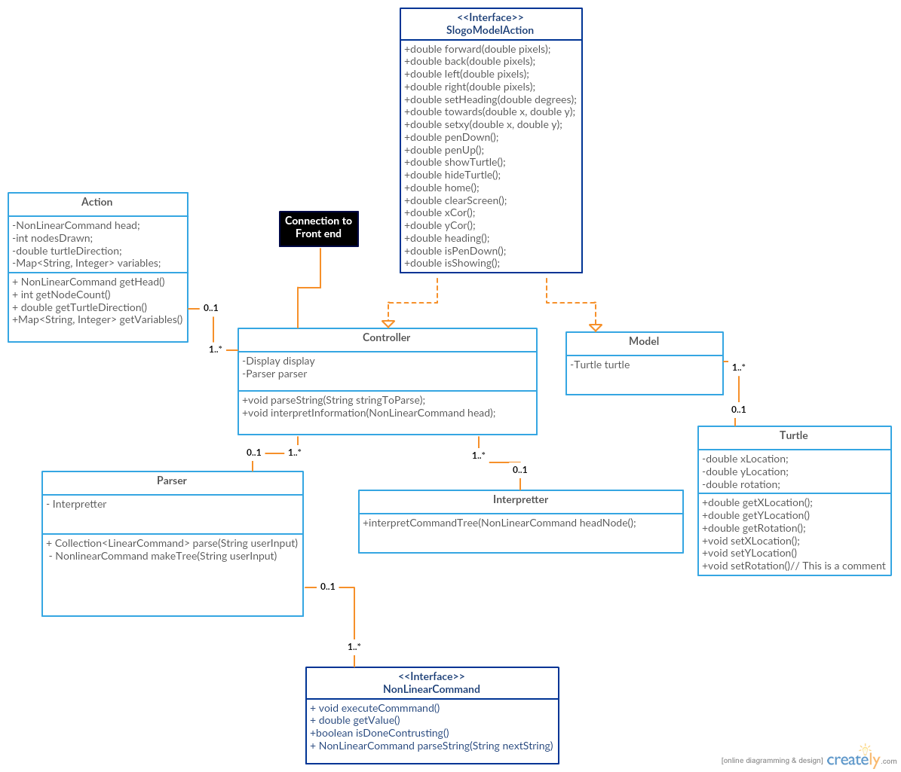

## Introduction

The intent of this program is to create an interactive IDE that allows users to execute code in the Slogo language. The goals of the project are as follows:

1. Create an easy to use interface that can easily be extended to include new features.  
2. Create a system that is capable of parsing String representing Slogo language into a Java structure in which Eclipse (or an other Java IDE) can interpret and execute. 
3. Off a parsing model that offers easy extendibility for commands/code following the Slogo read-eval-print style.
4. Create a communication system, through the controller, that connects the front and back end in a way that is efficient but still allows the front and back end to maintain their distinct purposes. 

Open: 
*Modules for adding to the display
*Commands (Linear and nonlinear) in the backend

Closed: 
*The main display 
*Parser that generates the Tree command structure 
*Interpreter that executes the tree of commands the parser generates 
*Controller that maintains the communication between the front and back end

## Design Overview

We have divided the project into 3 main components: the model, view, and controller.  

The **Model** is responsible for holding an abstract representation of the state of the board.  This includes where the turtle and other lines are located with respect to the central point and the turtle's rotation. To properly distinguish between the model and view this abstract information that the model holds should be able to be represented in a multitude of ways. The Model is responsible for interpreting a tree of commands given from the parser and updating its state.

The **View** is responsible for representing the information of the model.  The view should have no information of how the model constructed its information, but render the model of the screen.  In addition, the view should properly pass user data to the Controller for interpretation. Lastly, the view should offer features to the user relating to the state of the model, such as history.

The **Controller** is the link of communication between the Model and View.  The View gives information to the from the user to Parse.  The Controller then parses this information and gives it in the form in which the model can interpret, which in this case is a tree of commands.  The Model updates itself based on this input and sends back a series of "simple" commands to the Controller, which then delegates to the proper recipient to commit the simple command. 

In this form, the functionality is provided to change the visual representation of the model without changing the model itself and the model can be changed without changing the front end.

View: 
Model: Interpreter, NonLinearCommand, Model
Controller: Controller, Parser

#####APIs 

**SlogoModelActions**

The SlogoModelActions API is used for external communication between the Model.java class and the Controller.  Functionally, these will provide methods for the controller to tell the Model to manipulate its state based on input values.

**NonLinearCommand**

The NonLinearCommand API allows for extending the power of the Model.

######Classes

**Front End**

**Backend** 

The backend receives the String input from the Front end through the Controller.  The Controller delegates the parsing of the String code to the Parser class.  The Parse class uses the `parseString(String input)` method to convert the code into a tree of NonLinearCommands.  Each NonLinearCommand knows how many attributes and parameters it needs.  Thus, each NonLinearCommand will keep collection data until it is satisfied. This will continue until the tree recursively builds itself.  There is a method called `getNextCommand()` in the Parser class for getting the next readable instance in the form of a string.  This "readable instance" is the next word/symbol separated by whitespace.  The `getNonLinearCommandForString()` is a factory method that takes that String and converts it into a NonLinearCommand that can be used in the tree.

Once the information is parsed it is sent to the Interpreter to interpret.  The Interpreter loops through the tree, left to right, and turns the nested, NonLinearCommands into a linear progression of simplistic commands that can be converted directly to java code.  The Interpreter will execute the commands as it traverses the Tree.  If the given command corresponds to action that needs to be taken on the front end the information will be passed through the Controller.  Else, the command will execute to update the necessary component of the model, information stored in the Model class.  The Turtle class is currently written to store that attributes of the turtle in the Model.

Each new command that needs to be written will extend NonLinearCommand.  This requires each command to have an associated value, determine whether or not it is satisfied, and have the ability to execute.  In addition, in implementation the commands will store a map of their variables.  Thus, each command will have access to its variables and the variables of its parents. This will help automatically account for scope. 

The Action class is created every time the parse, interpret, delegate cycle is complete.  This Action class stores an instance of the last piece of code that was execute and that which was associated with it.  Saving this information allows for future implementation of dynamic history features like redo and undo.  This will be implemented in some form of a stack of Actions.  This will allow the user to pop off the top of the stack to revert to previous changes.

Once the code has been parsed, interpreted, and saved the Controller will tell the front end to render itself based on the state of the model.  

*Visualization*

## User Interface

## API Details

For the backend API refer to the *SlogoModelActions.java* and *NonLinearCommand.java* interfaces and accomplanying comments in the interfaces_slogo_team04.

**Exceptions* 

## API Example Code

*The user types 'fd 50' in the command window, and sees the turtle move in the display window leaving a trail, and the command is added to the environment's history.*

ButtonModule: 
1. `enterPressed()`
2. `Controller.parseString(input)`

Controller:
1. `Parser.parseString(input)`

Parser:
1. `parseString(input)`
2. `getNonLinaerCommandFromString(input)`
3. `Interpreter.interpretCommandTree(NonLinearCommand headNode)`  //updatesModel

Controller:

1. `interpretInformation(NonLinearCommand head)`

Display:

1. `draw(DrawData data)`

*Parser- generating tree from the input* (jji93)

	public void parseString(String stringToParse){
        
        NonLinearCommand myHeadNode = null; // now make the tree here
        makeCommandTree(myHeadNode);
        myInterpreter.interpretCommandTree(myHeadNode);
    }
    
*Interpret the tree it gets from the Parser* (ras70)

Interpreter: 

`interpretCommandTree(NonLinearCommand head)`

This drives each NonLinearCommand to execute:

NonLinearCommand:

`execute()`

Each individual implementation of the NonLinearCommand will have a different execute method.  However, they will all most likely be tied to lambda expressions that drive methods through the Controller class.

## Design Considerations

## Team Responsibilities

Jonathan Im (jji93):  
* Parser 
* Factory 

Ryan St Pierre (ras70) 
* Interpreter 
* Controller
